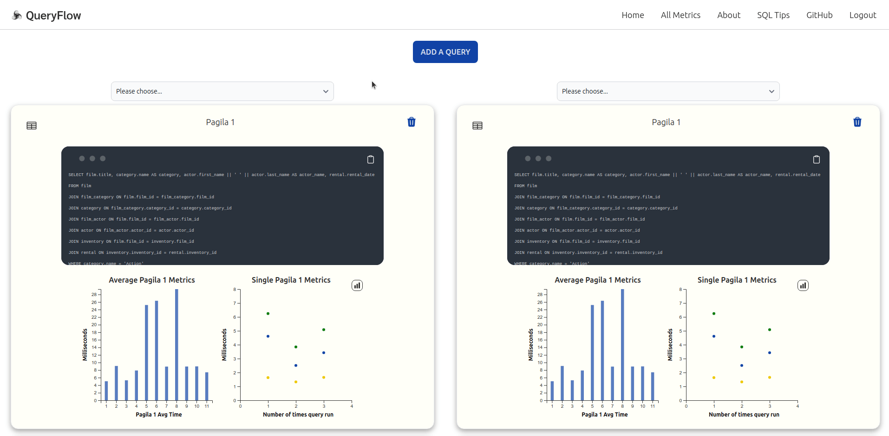
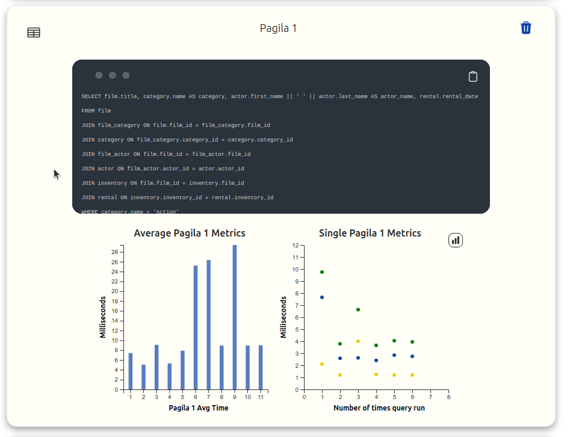
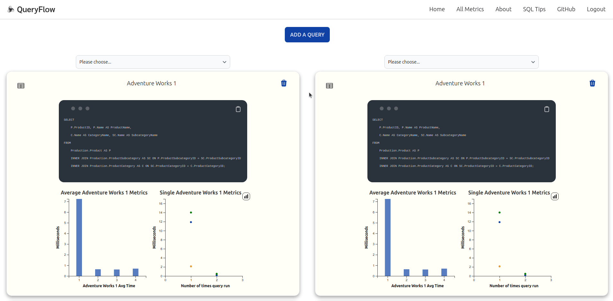

# QueryFlow

<!-- PROJECT LOGO -->
 

  

<h3 align="center">QueryFlow</h3>

  

    Analyze and visualize the performance of SQL queries
     
     
    <!--Do we need explore the docs? The README is basically the documentation.-->
    <a href="https://www.query-flow.com"><strong>Analyze & Visualize Now »</strong></a>
     
     
    <a href="https://github.com/oslabs-beta/query-flow-npm/issues">Report Bug</a>
    ·
    <a href="https://github.com/oslabs-beta/query-flow-npm/issues">Request Feature</a>
  

 

<!-- TABLE OF CONTENTS -->

  
Table of Contents

  <ol>
    <li>
      <a href="#about-the-project">About The Project</a>
    </li>
    <li>
      <a href="#getting-started">Getting Started</a>
    </li>
    <li><a href="#usage">Usage</a></li>
    <li><a href="#contributing">Contributing</a></li>
    <li><a href="#contact">Contact</a></li>
    <li><a href="#acknowledgments">Acknowledgments</a></li>
    <li><a href="#license">License</a></li>
  </ol>

<!-- ABOUT THE PROJECT -->

## About The Project
 

  

 

QueryFlow is a web application that securely highlights and visualizes how long a client's queries to a relational database take to complete. With these insights into the performance of an application's backend queries, developers can set data-backed thresholds with the queryflow.js NPM package, such that queries slower than a set threshold will be stored in a cache database. The [NPM package](https://www.npmjs.com/package/queryflow.js) automates the storage and retrieval of slow result sets from relational databases into a cache database.

<!-- GETTING STARTED -->

## Getting Started

Please visit: [www.query-flow.com](https://www.query-flow.com)

<!-- USAGE EXAMPLES -->

## Usage
 

1. After creating an account or logging in with your Gmail account, analyze a SQL query by clicking the blue 'ADD A QUERY' button.

2. Enter the _category of your query_, the _database URI_ **(not saved)**, the _query string_, the _number of query iterations_ used to calculate the average performance and the _delay_ between each of the iterations. Click 'Run Query'.

3. The QueryFlow logo in the top left corner will spin until the query analysis is complete. The analysis for each query will appear in an individual component.

  

 

4. Within each query's component, toggle between the query string used and a table of the performance of each iteration of the query. A bar chart shows the average speed for each time "Run Query" was executed for a particular query name. The scatter plot shows the most recent time "Run Query" was executed, with speeds (planning time, execution time, total time) for each iteration that contributes to the average time.

5. A dropdown menu at the top of the components allow you to select past queries for a side-by-side comparison. If you no longer need a particular query, there is a trashcan button to delete that particular query analysis.

  

  
  

6. The navigation bar at the top contains the 'All Metrics' page, which shows the average query times of all the different queries run. Furthermore, you can compare the performance of these queries with a Redis database by clicking the "GET REDIS METRICS" button on this page.

  

  
  

<!-- CONTRIBUTING -->

## Contributing

Contributions are what make the open source community such an amazing place to learn, inspire, and create. Any contributions you make are **greatly appreciated**.

If you have a suggestion that would make this better, please fork the repo and create a pull request. You can also simply open an issue with the tag "enhancement".
Don't forget to give the project a star! Thanks again!

1. Fork the Project
2. Create your Feature Branch (`git checkout -b feature/AmazingFeature`)
3. Commit your Changes (`git commit -m 'Add some AmazingFeature'`)
4. Push to the Branch (`git push origin feature/AmazingFeature`)
5. Open a Pull Request

See the [open issues](https://github.com/oslabs-beta/query-flow-npm/issues) for a full list of proposed features (and known issues).

<!-- CONTACT -->

## Contact

Email - queryflow58@gmail.com

Twitter - [@Query_Flow](https://twitter.com/Query_Flow)

LinkedIn - [Team Page](https://www.linkedin.com/company/query-flow/about/)

## Team

<!-- Include github and linkedin handles and links here? -->

-  **Vivek Patel** - [GitHub](https://github.com/vkpatel007) - [LinkedIn](https://www.linkedin.com/in/vivekpatel607/)
-  **Niko Amescua** - [GitHub](https://github.com/NikoAmescua) - [LinkedIn](https://www.linkedin.com/in/nikoamescua/)
-  **Ryan Campbell** - [GitHub](https://github.com/cronullarc) - [LinkedIn](https://www.linkedin.com/in/ryancampbelladr/)
-  **Philip Brown** - [GitHub](https://github.com/starfishpanda) - [LinkedIn](https://www.linkedin.com/in/philiplbrown/)
-  **George Greer** - [GitHub](https://github.com/ggreer91) - [LinkedIn](https://www.linkedin.com/in/george-greer/)

## Acknowledgements

The Team wholeheartedly thanks Chris Suzukida for his mentorship and support throughout the development of this project.

Here are his links!
-  [GitHub](https://github.com/csuzukida)
-  [LinkedIn](https://www.linkedin.com/in/chris-suzukida/)

<!-- LICENSE -->

## License

Distributed under the MIT License. See `LICENSE.txt` for more information.

(<a href="#readme-top">Back to Top</a>)

